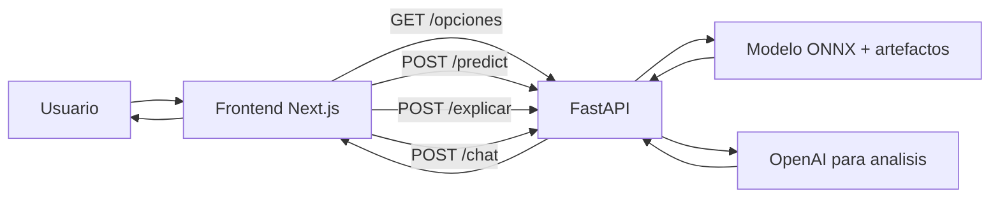

# Predictive Modeling for Seafood Demand

> Sistema web de prediccion de demanda para una distribuidora de mariscos, construido con FastAPI en backend y Next.js en frontend para apoyar inventario, planificacion y analisis gerencial.
[](https://www.python.org/)
[](https://fastapi.tiangolo.com/)
[](https://nextjs.org/)
[](https://onnxruntime.ai/)
[](https://openai.com/)
[](https://github.com/astral-sh/uv)

## Resumen

Este proyecto centraliza la predicción de demanda para una distribuidora de mariscos por producto, sucursal y horizonte temporal, apoyándose en un modelo de XGBoost guardado en formato onnx almacenado en artefactos. El backend en FastAPI gestiona la inferencia, las explicaciones locales y el asistente conversacional, mientras que el frontend en Next.js ofrece una interfaz operativa para filtrar, visualizar y analizar los resultados.

## Que resuelve

- Priorizacion de inventario por producto y sucursal.
- Planeacion operativa con horizonte semanal o mensual.
- Lectura rapida de resultados para toma de decisiones comerciales.
- Explicabilidad puntual para entender por que una prediccion sube o baja.
- Analisis conversacional para consultas ejecutivas sobre la demanda.

## Arquitectura



Flujo interno:

- El usuario selecciona productos, sucursales, fechas y horizonte desde el panel web.
- Next.js consulta `GET /opciones` para poblar filtros y luego envía la solicitud de prediccion a `POST /predict`.
- FastAPI valida la entrada, carga el estado del modelo y ejecuta inferencia con ONNX Runtime.
- `POST /explicar` genera factores interpretables para una fila puntual con LIME.
- `POST /chat` usa contexto de predicciones y OpenAI para producir analisis operativo y ejecutivo.

Componentes de apoyo:

- `backend/app/main.py` orquesta arranque, CORS, logging y rutas.
- `backend/app/services/model_service.py` concentra carga del modelo e inferencia.
- `frontend/lib/api.ts` y `frontend/lib/predict.ts` encapsulan las llamadas y transformaciones.

## Estructura

```text
predictive-modeling-seafood-demand/
├── artefactos/      Modelos y recursos de inferencia
├── backend/         API FastAPI, logging, schemas y servicio del modelo
├── frontend/        Aplicacion Next.js y componentes de interfaz
├── docs/            Documentacion tecnica del proyecto
└── notebooks/       Exploracion, entrenamiento y prueba de prediccion
```

## Stack

- Backend: FastAPI, Pydantic, Uvicorn, ONNX Runtime, LIME, OpenAI, python-dotenv.
- Frontend: Next.js 15, React 19, TypeScript, Tailwind CSS.
- Datos y modelo: artefactos ONNX, codificadores, metadatos y dataset historico.
- Entorno: Python 3.12+, Node.js 20+, npm.

## Artefactos

- `artefactos/modelo_mariscos.onnx` modelo listo para inferencia.
- `artefactos/importancia_variables.json` ranking de variables del modelo.
- `artefactos/label_encoders.pkl` codificacion de variables categoricas.
- `backend/.env` credenciales locales para OpenAI.

## Setup

1. Clona el repositorio y abre la raiz del proyecto.
2. Backend: crea el entorno virtual en `backend/` e instala `backend/requirements.txt`.
3. Crea `backend/.env` con `OPENAI_API_KEY=tu_clave_real`.
4. Verifica que existan los artefactos requeridos dentro de `artefactos/`.
5. Frontend: ejecuta `npm install` dentro de `frontend/`.
6. Inicia el backend con `uvicorn backend.app.main:app --reload --port 8000`.
7. Inicia el frontend con `npm run dev` y abre `http://localhost:3000`.

Requisitos base:

- Python 3.12 o superior.
- Node.js 20 o superior.
- Acceso a una clave valida de OpenAI si se usa `/chat`.

## Endpoints clave

- `GET /` estado general del servicio.
- `GET /opciones` catalogo para poblar la interfaz.
- `POST /predict` inferencia de demanda.
- `POST /explicar` explicacion local de una prediccion.
- `POST /chat` asistente IA con contexto operativo.

## Operacion local

- Ejecutar ambos servidores al mismo tiempo: backend en `8000` y frontend en `3000`.
- Si el frontend consume otro host, definir `NEXT_PUBLIC_API_URL` en `frontend/.env.local`.
- Si falta `OPENAI_API_KEY`, el backend no podra inicializar el cliente de chat.
- Los errores de carga casi siempre indican ausencia de artefactos o una ruta incorrecta desde la raiz.

## Autores

Diego Bravo Email: brzoale2510@gmail.com GitHub: github.com/diegobravo10

Sebastián Machado Email: salejomac1210@gmail.com GitHub: github.com/SMachadoP

Sebastian Verdugo Email: @sebastianvccvgmail.com GitHub: github.com/verdugong

Ariel Paltán Email: arielpaltan203@hotmail.com GitHub: github.com/ArielPaltanC

